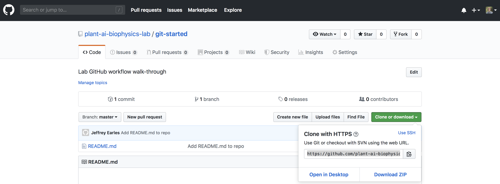
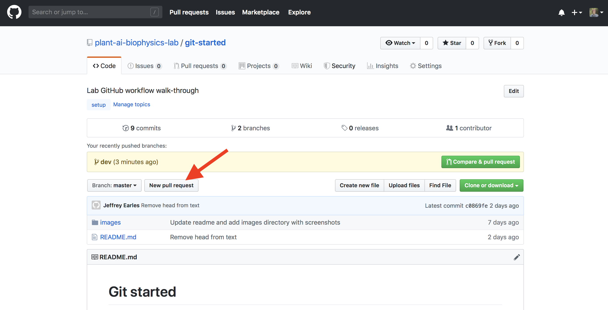
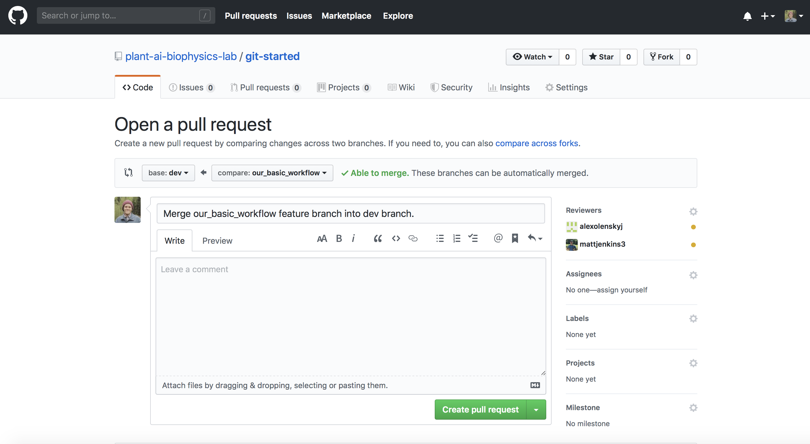

# Git started

<h4><b> A walkthrough of the Plant AI and Biophysics Lab's git workflow. </b></h4>

## Motivation

Our lab aims to create high quality computational tools for solving basic and applied problems related to plants. To maximize efficiency and scalability, we apply a lightweight software engineering/analytics workflow built on Git version control. The documentation below introduces basic concepts, Git workflow procedures and code examples, and discusses more advanced topics like squash-rebase and merge conflicts.

Don't hesitate to help us improve this workflow by making suggestions or submitting a pull request.

## Terminology

Here are some of my loose definitions of basic git concepts...

<i>Agents</i>
- <b>Version control system</b>: A system that records changes to a file or set of files over time so that you can recall specific versions later.
- <b>GitHub repository</b>: Often shortened to 'repo', a version controlled codebase.
- <b>GitHub organization</b>: A collection of team members and external collaborators that are working together to build one or more repos.
- <b>Member</b>: A person belonging to a GitHub organization.
- <b>Collaborator</b>: A person contributing to a given repo.

<i>Objects</i>
- <b>Codebase</b>: All of the code (and non-code) files that constitute your software.
- <b>Local</b>: The computer that you're currently working on.
- <b>Remote</b>: The computers maintained by GitHub in some server farm where you store all your repos.
- <b>Branch</b>: One of many possible active versions of a codebase, either local or remote.

<i>Actions</i>
- <b>Clone</b>: To copy a repository from the remote server to a local machine for the first time.
- <b>Pull</b>: To update a local branch based on the latest version on the remote server.
- <b>Status</b>: Tells you which files in your current branch are different from the remote server.
- <b>Add</b>: Stage files from your current branch for upload to the version on the remote server.
- <b>Commit</b>: Instate local changes and prepare for upload to remote server.
- <b>Push</b>: Upload changed and committed files to the remote server.
- <b>Checkout</b>: Switch to a different (either new, locally hosted, or remotely hosted) branch
- <b>Merge</b>: Combine two branches together. <b>This can be a little tricky!</b>


## Our basic workflow

We use a `master` <-> `dev` <-> `<feature_branch>` development workflow. Two branches, `master` and `dev`, require a pull request (PR) to one or more collaborators prior to merging new code (step 7 below). Contributors to a repo can create any additional number of `<feature_branch>` branches. These third-order branches are where new software features are born. We try to keep a 1:1 feature to branch mapping. That means each branch should be associated with *a single* feature. Prior to merging into the `dev` branch, and once you've tested your `<feature_branch>` code sufficiently, you can ask one or more collaborators to review it by making a PR. Following several merges of different `<feature_branch>` branches into `dev` it's probably worthwhile to merge `dev` into `master`. This event should be accompanied by releasing a new version, e.g. `v0.1`.

As an example, let's say that I want to develop a new software feature, called `our_basic_workflow`. I'll do the following:

1. Clone the repo, which starts as the `master` branch.

```bash
$ git clone https://github.com/plant-ai-biophysics-lab/git-started.git
```

You can grab the repo URL from the remote repo. For example,



Examine the active branch and the other branches that are tracked locally.

```bash
$ git branch
```

2. Change into the `git-started` repo directory and checkout the existing `dev` branch from the remote.

```bash
$ cd git-started
$ git checkout dev
```

3. Checkout a new branch, called `our_basic_workflow` for instance, on your local machine.

```bash
$ git checkout -b our_basic_workflow

```

Again, examine the active branch and the other branches that are tracked locally.

```bash
$ git branch
```

4. CODE TEST CODE TEST CODE TEST. Once you've finished up a small chunk of code changes, it's probably a good idea to commit to the remote repo.

5. First, take a look at which files changed from the index file.

```bash
$ git status
```

6. Then, add updated files to staging area, commit with descriptive message, and push to remote repo (steps 5 and 6 below).

```bash
$ git add <insert-files-to-stage> # repeat this for each file
$ git commit -m 'Insert useful message here...'
$ git push origin our_basic_workflow
```

7. Submit a PR to a collaborator.

The easiest way to do this is through the online UI.



After click the button above, define what merge you are proposing, whom you want to review it, and the create the pull request.



8. Wait for PR approval or suggestions for edits from the proposed reviewers.

9. Once PR is approved, merge `our_basic_workflow` into `dev` branch on local.

To do this, following good practice, examine the active branch and the other branches that are tracked locally.

```bash
$ git branch
```

Assuming you are in the `our_basic_workflow` branch, check out the `dev` branch.

```bash
$ git checkout dev
```

Now, merge the `our_basic_workflow` branch into the `dev` branch.

```bash
$ git merge our_basic_workflow
```

This command merges from the specified branch, `our_basic_workflow` in this case, into the currently active branch `dev`.

10. Add, commit and push updated version of `dev` to remote. 

```bash
$ git add <insert-files-to-stage> # repeat this for each file
$ git commit -m 'Insert useful message here...'
$ git push origin dev
```

11. Delete local and remote copies of `our_basic_workflow` branch.

```bash
$ git checkout dev
$ git branch -D our_basic_workflow
$ git push origin --delete our_basic_workflow
```

12. Start again at step (3) with a new `<feature_branch>`.


## Advanced workflow and functions

### Basic Configuration

```
git config --global user.name "<Your_Name>"
```
```
git config --global user.email "<Your_Email>"
```
Do not omit the double quote.

### Useful Aliases

#### History
Decorated `log` command.

**Setup**
```
git config --global alias.hist "log --oneline --graph --decorate --all"
```

**Usage**
```
git hist
```

### Squash and rebase

Coming soon!

### Merge conflicts

Coming soon!

