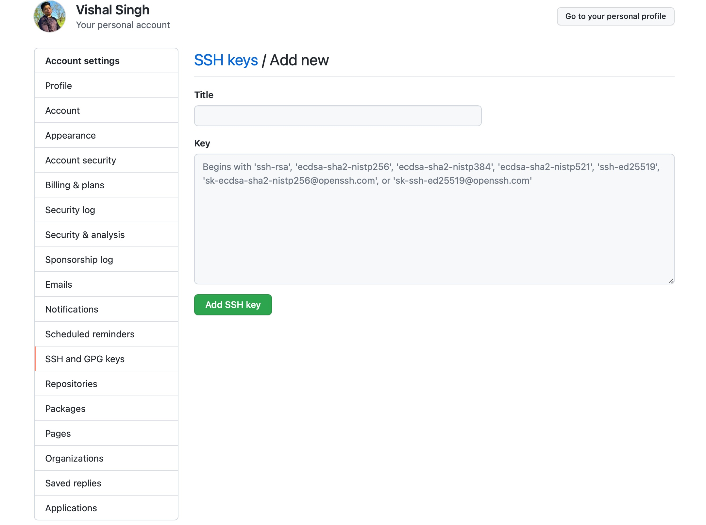

# Adding SSH Keys to your Github Account

## Accessing the Public Key
```
cd ~/.ssh
cat id_rsa.pub
```
Copy the contents of your public key.

## Setting up the key in Github Account
Click on your account in the upper-right corner. Go to `Account > Setting > SSH and GPG Keys > New SSH Key` <br>



Set a title to identify the computer that has the public key, and then paste the contents of 'id rsa.pub' into key. Then, to add the key, enter your github password.

## Checking Github Access
```
cd ~/.ssh
ssh -T git@github.com
```

If everything is set-up correctly you'll be prompted with "Are you sure to continue connecting", type `yes`. After that enter your passphrase, to which a message referring to your github username will popup.


